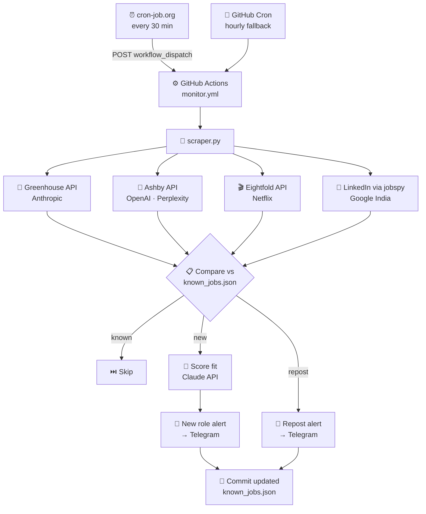

# proj-flash ⚡

Monitors PM job boards at top AI companies and sends instant Telegram alerts the moment a new role is posted.

## Why this exists

When applying for jobs, being early matters. A role posted 10 minutes ago has near-zero applicants — your resume gets read in isolation, there's no benchmark yet, and recruiters are actively looking to fill the pipeline. The same role 48 hours later has hundreds of applicants and a very different dynamic.

proj-flash exists to put you in that first wave, every time. It runs silently in the background, checks every 30 minutes, and pings you on Telegram the moment something new goes live — before most people even know the role exists.

## What it tracks

| Company | Source | Coverage |
|---|---|---|
| Anthropic | Greenhouse API | All PM roles (global) |
| OpenAI | Ashby API | All PM roles (global) |
| Perplexity | Ashby API | All PM roles (global) |
| Netflix | Eightfold API | All PM roles (global) |
| Google | LinkedIn via jobspy | PM roles in India |

## How it works

1. **cron-job.org** triggers the scraper every 30 minutes via GitHub's `workflow_dispatch` API — reliably, every time
2. GitHub Actions runs the scraper and compares new roles against `known_jobs.json` (persisted state)
3. On a new role: scores your resume fit via Claude API, sends a Telegram notification
4. `known_jobs.json` is auto-committed back to the repo after each run
5. GitHub's built-in cron runs hourly as a fallback in case cron-job.org is ever down

## Architecture



## Notification format

```
🚨 New Anthropic PM Role

Product Manager, Claude Code
📍 Remote / Not specified
🕐 Posted: 01 May 2026, 10:30 AM IST
🎯 Fit: Strong — 8yr PM, AI background matches well (anuj-goyal)

Apply → https://job-boards.greenhouse.io/...

Total Anthropic PM roles open: 3
```

## Setup

### 1. Fork or clone this repo

**Fork** (recommended) — keeps your resume and config private, lets you pull upstream improvements:

```
Fork via GitHub → your-username/proj-flash
```

**Clone** — if you want a clean local copy to customise from scratch:

```bash
git clone https://github.com/anujg1807/proj-flash.git
cd proj-flash
```

### 2. Add GitHub Actions secrets

Go to your repo → **Settings → Secrets and variables → Actions** and add:

| Secret | Where to get it |
|---|---|
| `TELEGRAM_BOT_TOKEN` | Create a bot via [@BotFather](https://t.me/botfather) |
| `TELEGRAM_CHAT_ID` | Get your chat ID from [@userinfobot](https://t.me/userinfobot) |
| `ANTHROPIC_API_KEY` | [console.anthropic.com](https://console.anthropic.com) — optional, enables fit scoring |

### 3. Add your resume

Drop a `.txt` file in `resumes/` (see `resumes/README.txt`). The filename becomes your resume label in notifications.

### 4. Trigger manually to test

Go to **Actions → Anthropic PM Job Monitor → Run workflow**.

### 5. Set up cron-job.org (primary trigger)

GitHub Actions' built-in cron is unreliable on free accounts — you'll get 8–15 runs/day instead of 48. cron-job.org fixes this by calling GitHub's API directly.

1. Sign up at **cron-job.org** (free)
2. Create a new job with:
   - **URL:** `https://api.github.com/repos/YOUR_USERNAME/proj-flash/actions/workflows/monitor.yml/dispatches`
   - **Schedule:** every 30 minutes
   - **Method:** POST
   - **Headers:**
     ```
     Authorization: Bearer YOUR_GITHUB_TOKEN
     Accept: application/vnd.github+json
     ```
   - **Body (JSON):** `{"ref": "main"}`
3. Generate a GitHub token at **Settings → Developer settings → Personal access tokens** with `repo` scope

## Customising for your needs

### Track different companies

- **Greenhouse ATS** (e.g. Notion, Stripe, Figma): add an entry to `GREENHOUSE_COMPANIES` in `scraper.py`
- **Ashby ATS** (e.g. Linear, Vercel, Loom): add an entry to `ASHBY_COMPANIES` in `scraper.py`
- **Eightfold ATS** (e.g. Netflix, Walmart, Nvidia): add an entry to `EIGHTFOLD_COMPANIES` in `scraper.py`

Each entry just needs the company `name`, ATS `slug` or `host/domain`, and a list of title keywords to filter on.

### Change the job filter

Edit `pm_title_keywords` in each company config to match whatever roles you're hunting — engineering, design, research, anything.

### Change the location

For Google (LinkedIn search), update `GOOGLE_LOCATION` in `scraper.py`. For Greenhouse/Ashby companies, the API returns all roles globally — filter by location inside `get_greenhouse_pm_jobs()` or `get_ashby_pm_jobs()` if needed.

### Change the check frequency

The primary trigger is cron-job.org (see Setup step 5). To change the frequency, update the schedule there.

The GitHub cron in `.github/workflows/monitor.yml` is a hourly fallback only:

```yaml
- cron: "0 * * * *"  # hourly fallback
```

## Changelog

```
🟣 v1.4 ── May 19, 2026
│   🎬  Added Netflix monitoring via Eightfold API (29 PM roles tracked globally)
│   🔧  Fixed Eightfold scraper — switched to department filter + pagination, was silently missing 19 roles
│   ⏱️  Moved to cron-job.org as primary trigger (reliable every 30 min); GitHub cron now hourly fallback
│
🟣 v1.3 ── May 18, 2026
│   🐛  Fixed raw pandas nan showing as posted date in Google job logs
│
🟣 v1.2 ── May 5, 2026
│   🎯  Added resume-to-job fit scoring via Claude API — every Telegram alert now includes a fit rating
│
🟣 v1.1 ── May 3, 2026
│   🤖  Added OpenAI and Perplexity monitoring via Ashby API
│   🔄  Added repost detection — alerts when a known job is relisted with a newer date
│   🔀  Switched Google source to LinkedIn via python-jobspy to bypass bot detection
│   ⚡  Doubled check frequency from hourly to every 30 minutes
│
🟢 v1.0 ── May 1, 2026 — Initial release
    🚀  Anthropic PM monitoring via Greenhouse API
    📬  Telegram notifications with IST timestamps
    💾  State persisted in known_jobs.json, auto-committed after each run
```
